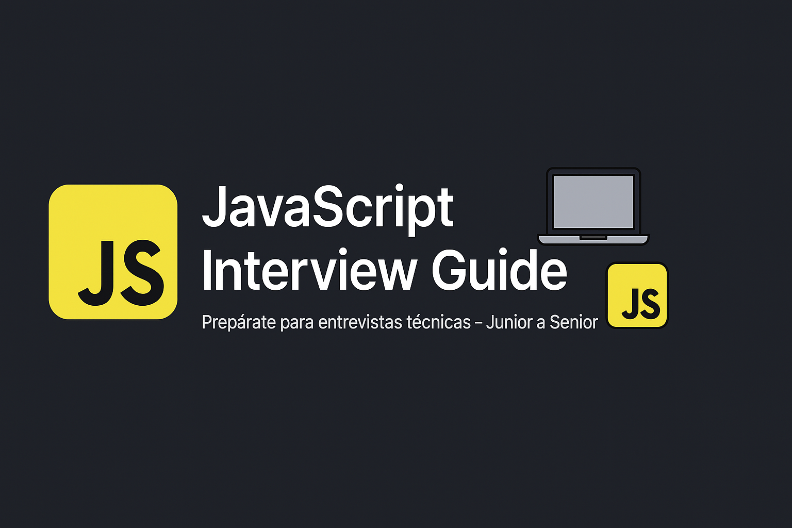

  

# 📚 Guía de Estudio para Entrevistas Técnicas en JavaScript

Bienvenido a esta guía práctica de estudio enfocada en ayudarte a prepararte para entrevistas técnicas de desarrollo con JavaScript, organizada por niveles: Junior, Middle y Senior.

Este repositorio incluye:
- Conceptos clave explicados con ejemplos.
- Preguntas técnicas con respuestas detalladas.
- Casos reales que podrían aparecer en entrevistas.
- Recursos adicionales recomendados.

---

## 🧭 Estructura del contenido

| Nivel     | Conceptos | Preguntas |
|-----------|-----------|-----------|
| 🟢 Junior | [conceptos.md](junior/conceptos.md) | [preguntas.md](junior/preguntas.md) |
| 🟡 Middle | [conceptos.md](middle/conceptos.md) | [preguntas.md](middle/preguntas.md) |
| 🔴 Senior | [conceptos.md](senior/conceptos.md) | [preguntas.md](senior/preguntas.md) |

---

## 📌 ¿Qué cubre esta guía?

### Junior
- Tipos de datos, operadores y estructuras básicas
- Variables (`var`, `let`, `const`)
- DOM, eventos, `JSON`, `typeof`, funciones, `forEach`, etc.

### Middle
- Closures, scope, contexto (`this`)
- Promesas, async/await, manejo de errores
- Métodos de arrays avanzados (`map`, `reduce`, etc.)
- Modularización, destructuring, optimización básica

### Senior
- Event Loop profundo, micro/macro tasks
- Patrones de diseño, SOLID, arquitectura escalable
- Web Workers, seguridad, testing avanzado
- Performance, debouncing, currying, inmutabilidad, TypeScript

---

## 🎯 Objetivo

Dar una guía completa que puedas estudiar paso a paso o repasar antes de una entrevista técnica. Puedes usarlo como checklist, apuntes, o crear flashcards a partir de las preguntas.

---

## 📚 Recursos recomendados

- 📘 [You Don’t Know JS (book series)](https://github.com/getify/You-Dont-Know-JS)
- 📄 [MDN Web Docs](https://developer.mozilla.org/es/docs/Web/JavaScript)
- 🛠️ [JavaScript.info](https://javascript.info/)
- 💡 [Frontend Interview Handbook](https://frontendinterviewhandbook.com/)

---

## 🚀 ¿Cómo contribuir?

¿Quieres aportar más preguntas, correcciones o nuevos niveles como `React`, `Node.js`, `TypeScript` o incluso `Coding Challenges`?

¡Pull requests y sugerencias son bienvenidas! 🙌

---

## 🧑‍💻 Autor

Creado por [Absa García](https://github.com/absagarcia) – desarrollador de software y creador de contenido.

---

## ☕ Apoya el proyecto

Si este repositorio te ayudó, considera compartirlo o mencionarlo en tus redes, blog o entrevistas. También puedes seguir el podcast:

🎙️ [Coffee and Code en Spotify](https://open.spotify.com/show/coffee-and-code)

---
